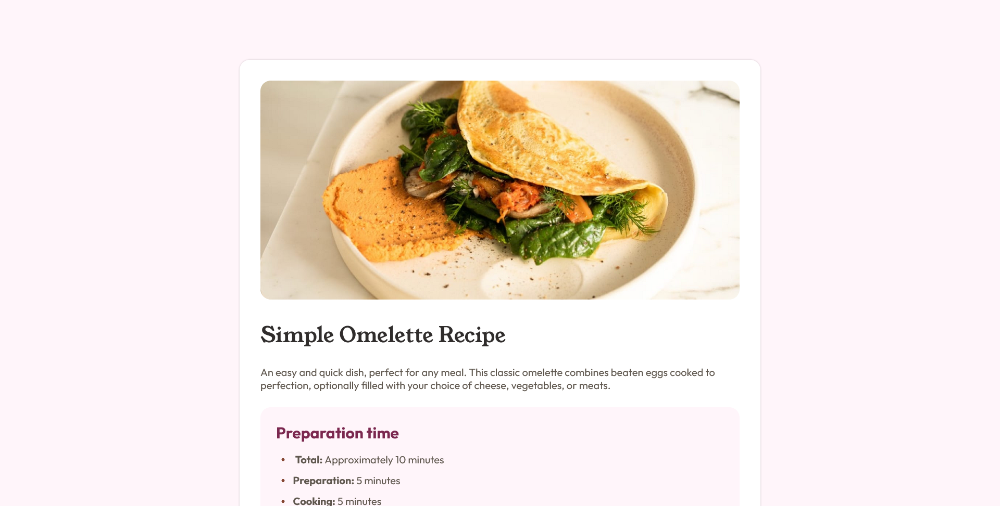

# Frontend Mentor - Recipe page solution

This is a solution to the [Recipe page challenge on Frontend Mentor](https://www.frontendmentor.io/challenges/recipe-page-KiTsR8QQKm). Frontend Mentor challenges help you improve your coding skills by building realistic projects.

## Table of contents

- [Overview](#overview)
  - [The challenge](#the-challenge)
  - [Screenshot](#screenshot)
  - [Links](#links)
- [My process](#my-process)
  - [Built with](#built-with)
  - [What I learned](#what-i-learned)
- [Author](#author)
- [Acknowledgments](#acknowledgments)

## Overview

### The challenge

This is my fourth project. I love it. This project isn't similar to previous three projects I did.

### Screenshot

### Links

- Solution URL: [Add solution URL here](https://github.com/MgMyatHtayKhant/recipe-page-main)
- Live Site URL: [Add live site URL here](https://frontend-recipe-page-main.netlify.app/)

## My process

### Built with

- Semantic HTML5 markup
- CSS custom properties
- Flexbox

### What I learned

I learned about how to do naming and labeling in html and css a lot.

## Author

- Website - [Saul](https://saul-homepage.netlify.app/)
- Frontend Mentor - [@yourusername](https://www.frontendmentor.io/profile/yourusername)

## Acknowledgments

This project is done by myslef and I'm proud of it.
